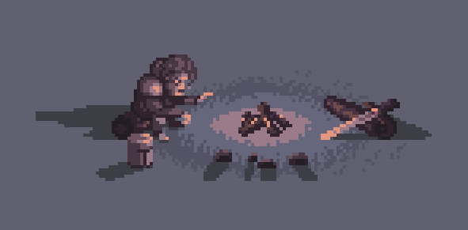

# kich-chat-animation

Kick.com canlı sohbet mesaj aktivitesine göre alev animasyonu gösteren web uygulaması.

## Özellikler

- Kick.com kanal kullanıcı adı ile canlı sohbet aktivitesini izler.
- Sohbet mesajı yoğunluğuna göre alev animasyonu seviyesini otomatik olarak günceller.
- Kullanıcı dostu arayüz ve kolay paylaşılabilir bağlantı üretimi.
- Tamamen istemci tarafında çalışır, ek sunucuya ihtiyaç yoktur.

## Kurulum

1. Bu repoyu klonlayın veya ZIP olarak indirin:
        `git clone https://github.com/safakcebin/kich-chat-animation.git`
1. Tüm dosyaları bir klasöre çıkarın.
2. `index.html` dosyasını bir tarayıcıda açın.

## Kullanım

1. Sayfa açıldığında, "Username" alanına Kick kanalınızın kullanıcı adını girin.
2. "Start" butonuna tıklayın.
3. Sohbet aktivitesine göre alev animasyonu ve seviye göstergesi güncellenir.
4. Oluşan bağlantıyı kopyalayarak yayın aracınıza (obs ...) tarayıcı kaynağı olarak ekleyerek görüntüleyebilirsiniz.
5. Oluşan pencerede istemediğiz kısımları kırparak temizleyiniz.

## GitHub Pages ile Kullanım

Projenizi GitHub Pages üzerinden kolayca paylaşabilirsiniz. Yayınlandıktan sonra uygulamanıza şu şekilde erişebilirsiniz:

**Base URL:**
    `https://safakcebin.github.io/kich-chat-animation/`

**Kanal parametresi ile kullanım:**
    `https://safakcebin.github.io/kich-chat-animation/?username=<kick-kullanici-adi>`

Örnek:
    `https://safakcebin.github.io/kich-chat-animation/?username=kickresmi`

Yukarıdaki bağlantıyı paylaşarak veya tarayıcınızda açarak doğrudan ilgili Kick kanalının sohbet aktivitesine göre animasyonu görebilirsiniz.

> Not: `flame` klasöründeki görsellerin de repoda olduğundan emin olun.

## Ekran Görüntüsü

## İstatistik Hesaplama

Alev seviyesi ve mesaj/saniye istatistiği şu şekilde hesaplanır:

- Uygulama, gelen sohbet mesajlarının zaman damgalarını kaydeder.
- Her saniye, son 60 saniyede ve son 180 saniyede gelen toplam mesaj sayısı ayrı ayrı hesaplanır.
- Son 180 saniyede hiç mesaj yoksa, alev seviyesi 2'de sabit kalır.
- Son 180 saniyede en az bir mesaj geldikten sonra:
    - Son 60 saniyelik mesaj/saniye ortalaması, 180 saniyelik ortalamadan anlamlı şekilde yüksekse alev seviyesi artar.
    - Son 60 saniyelik ortalama, 180 saniyelik ortalamadan düşükse alev seviyesi azalır.
    - Değilse, aşağıdaki aralıklara göre seviye belirlenir:
        - 0.2 ve altı: Seviye 1
        - 0.21 - 0.5: Seviye 2
        - 0.51 - 1: Seviye 3
        - 1.01 - 2: Seviye 4
        - 2 üzeri: Seviye 5
- Alev animasyonu ve seviye etiketi, bu değerlere göre güncellenir.
